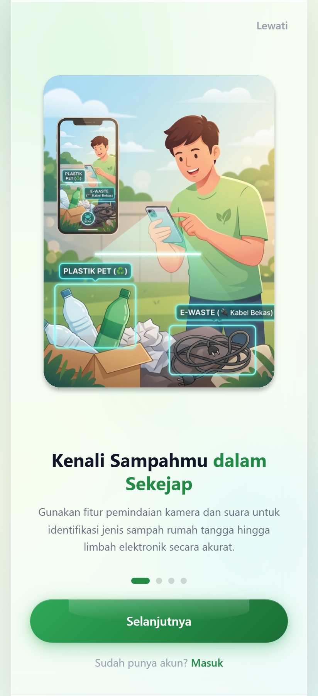

# UPTERRA

An eco-tech waste management app: report waste, identify e-waste with an AI camera scan, and trade recyclables through a built-in marketplace.

Live at **[upterra.vercel.app](https://upterra.vercel.app)**



## Features

### Waste reporting
Report illegal dumping or a full collection point from the app, track the status of everything you have submitted, and confirm once it has been handled. Locations are shown on an interactive map.

### AI scan
Point the camera at an item and the app identifies what kind of e-waste it is, then explains how to handle it safely. Two modes are available:

- **Live scan** streams camera frames to the Gemini Live API and returns structured detection results with a confidence score.
- **Video call** is a full-screen conversational mode with microphone input, spoken responses, a live transcript, and an animated AI visualiser.

Both fall back gracefully and reconnect on their own if the connection drops.

### Marketplace
Browse recyclable goods from merchants, open a product chat, add items to a cart, and track orders.

### Dashboard
Waste statistics, a recent-activity feed, and a map view of reports.

## Tech stack

- **React 19** with **Vite**
- **Tailwind CSS v4**
- **Motion** (Framer Motion) for transitions and interactions
- **Zustand** for state (auth, cart, orders, waste)
- **React Router 7**
- **Lucide** icons
- **Gemini Live API** over WebSocket, with a REST fallback

## Project structure

```
src/
├── components/
│   ├── common/          # Button, Card, Modal, Toast, Spinner, ...
│   ├── dashboard/       # StatCard, WasteChart, MapView, RecentActivity
│   ├── layout/          # Navbar, Sidebar, BottomNav, ProtectedRoute
│   ├── scan/            # CameraView, ScanOverlay, DetectionResult
│   ├── waste/           # WasteCard, WasteCategory, WasteList, WasteTip
│   └── GeminiLiveVideoCall.jsx
├── hooks/               # useAuth, useCamera, useGeminiLive, useLocation, ...
├── pages/               # Onboarding, Login, Home, Dashboard, Scan, Market, ...
├── services/            # api, authService, geminiLive, locationService, ...
├── store/               # Zustand stores
├── styles/              # tokens, base, components, app, scan
└── utils/               # constants, formatters, helpers, validators
```

## Requirements

Node.js 22, and a Gemini API key. The version is pinned in `engines` so local and deployed builds agree.

## Running it locally

```bash
npm install
cp .env.example .env
```

Put your key in `.env`:

```
GEMINI_API_KEY=your_key_here
```

Note the name: **no `VITE_` prefix**. That is deliberate, and the next section explains why it matters.

Then start the dev server:

```bash
npm run dev
```

Open the **Scan** section to try the AI scan or the video call mode.

To build for production:

```bash
npm run build
```

## How the API key is handled

The key never reaches the browser.

**Anything prefixed `VITE_` is baked into the client bundle at build time.** That is Vite's documented behaviour, not a bug. An earlier version of this app read `VITE_GEMINI_API_KEY` in the browser and opened its Live API WebSocket with `?key=<the key>`, which meant the key shipped inside the JavaScript every visitor downloads. Keeping it in `.env` protected it from git, not from anyone who opened DevTools.

Being on the Gemini free tier does not change that. An exposed key still lets strangers spend your quota, the requests still count against your Google account, and if billing is ever enabled on the project they become chargeable. Google also scans for leaked keys and can disable one without warning, which takes the app down with it.

### What it does now

The key lives only in the server environment. The browser asks for a short-lived [ephemeral token](https://ai.google.dev/gemini-api/docs/ephemeral-tokens) and connects with that instead:

```
Browser ──POST /api/gemini-token──►  server        (holds GEMINI_API_KEY)
                                       │
                                       ▼
                             Gemini auth_tokens
                                       │
Browser ◄────── single-use token ──────┘

Browser ──wss://…?access_token=<token>──► Gemini Live API
```

- [`api/gemini-token.js`](api/gemini-token.js) reads `GEMINI_API_KEY` and mints a token that is **good for one use**, may start a session within **60 seconds**, and expires after **30 minutes**.
- [`src/services/geminiLive.js`](src/services/geminiLive.js) takes a `getToken` function instead of a key and connects with `?access_token=`.
- [`src/hooks/useGeminiLive.js`](src/hooks/useGeminiLive.js) fetches a fresh token immediately before each session.

Because `vite dev` does not run the functions in `api/`, `vite.config.js` serves that same handler through Vite middleware so `npm run dev` behaves like production.

You can confirm the key is gone from a build:

```bash
npm run build
grep -o "access_token=" dist/assets/*.js   # present
grep -c "AIza" dist/assets/*.js            # 0
```

### Deployment

Set `GEMINI_API_KEY` as an environment variable on the host, then redeploy. Do not add a `VITE_` prefix to it, and do not log it. Even with this setup it is worth restricting the key to the Generative Language API in the Google Cloud console, and leaving billing disabled so the worst case is an exhausted free quota.

Remember to **delete any old `VITE_GEMINI_API_KEY`** variable. If it is still set, nothing breaks, but the old key gets inlined into every new build again.

### If the token endpoint returns 502

Check the function logs. The usual cause is the **key format**.

Google AI Studio now issues some keys with an `AQ.` prefix instead of the older `AIzaSy` one, and `AQ.` keys are widely reported to fail against `generativelanguage.googleapis.com` with `API key not valid` — which is exactly the host `api/gemini-token.js` calls. A key can work for a direct Live API WebSocket and still be rejected here, so "it used to work" is not a reliable signal.

If that is what you are hitting, create the key from the Google Cloud console instead of AI Studio:

1. [Enable the Generative Language API](https://console.cloud.google.com/apis/library/generativelanguage.googleapis.com) on the project.
2. Create an API key under [APIs & Services → Credentials](https://console.cloud.google.com/apis/credentials). Those come out in `AIzaSy` form.
3. Restrict it to the Generative Language API.

### If a key has already been committed

Rotate it. Deleting the file in a later commit does not help, because the value stays in the repository history and in every clone anyone has already made. Rewriting history is optional cleanup; reissuing the key is the part that actually closes the hole.

## Further reading

`docs/GEMINI_LIVE_VIDEO_CALL.md` covers the Gemini Live architecture, usage examples, and error handling in detail.
