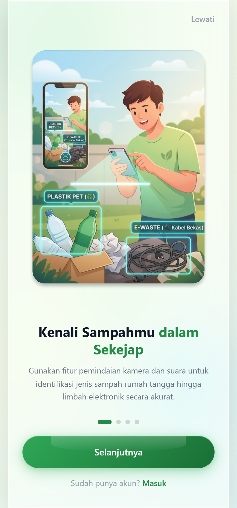
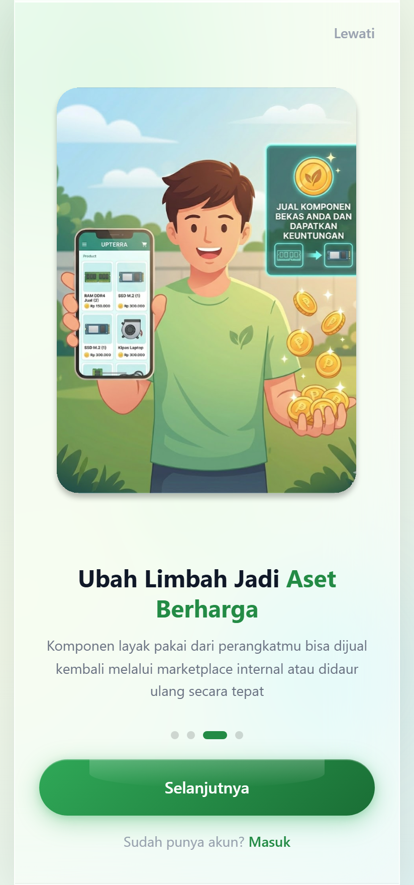

<div align="center">

# UPTERRA

**Turn household and electronic waste into something worth keeping.**

Report illegal dumping, identify e-waste by pointing a camera at it, and resell the parts that still have value.

[](https://react.dev)
[](https://vite.dev)
[](https://tailwindcss.com)
[](https://ai.google.dev)
[](https://upterra.vercel.app)

### [Open the live app →](https://upterra.vercel.app)

<table>
<tr>
<td width="50%"></td>
<td width="50%"></td>
</tr>
</table>

</div>

## Overview

Most people know electronics should not go in the bin, and stop there. UPTERRA closes that gap: it tells you what an item actually is, whether it is hazardous, and what to do with it next — compost it, drop it at a collection point, or list it for sale.

Built as a team project for a mobile-first Indonesian audience.

## Features

### Waste reporting

Submit a report for illegal dumping or a full collection point, follow its status through to resolution, and see every report on an interactive map.

### AI scan

Point the camera at an item and Gemini identifies it, classifies it as organic, inorganic, or e-waste, flags hazardous material, and explains how to handle it. Two modes share the same pipeline:

| Mode | What it does |
|---|---|
| **Live scan** | Streams camera frames and returns structured detections with a confidence score |
| **Video call** | Full-screen conversational mode with microphone input, spoken replies, a running transcript, and an audio visualiser |

Detections come back as JSON, so the result feeds straight into the marketplace and disposal guidance rather than being a wall of text.

### Marketplace

Browse recyclable goods from merchants, open a product chat, build a cart, and track orders.

### Dashboard

Waste statistics, a recent-activity feed, and a map overview of reports.

## Tech stack

| Layer | Choice |
|---|---|
| UI | React 19, React Router 7 |
| Build | Vite 8 |
| Styling | Tailwind CSS v4, Motion for transitions |
| State | Zustand (auth, cart, orders, waste) |
| AI | Gemini Live API over WebSocket, brokered by a serverless function |
| Icons | Lucide |
| Hosting | Vercel |

## Getting started

Requires **Node.js 22**. The version is pinned in `engines` so local and deployed builds agree.

```bash
npm install
cp .env.example .env      # then add your GEMINI_API_KEY
npm run dev
```

Open the **Scan** section to try the camera or video-call mode.

```bash
npm run build             # production build
npm run preview           # serve that build locally
npm run lint              # eslint
```

## Configuration

The app needs one variable, `GEMINI_API_KEY`, and it is read **only on the server**. The browser never receives it: it asks `/api/gemini-token` for a single-use ephemeral token and opens its Gemini session with that.

Note the missing `VITE_` prefix — that is deliberate, since Vite inlines any `VITE_*` value into the client bundle.

Full detail, including deployment steps and troubleshooting, is in **[docs/CONFIGURATION.md](docs/CONFIGURATION.md)**.

## Project structure

```
api/
└── gemini-token.js       # mints short-lived Gemini tokens, server side
src/
├── components/
│   ├── common/           # Button, Card, Modal, Toast, Spinner, ...
│   ├── dashboard/        # StatCard, WasteChart, MapView, RecentActivity
│   ├── layout/           # Navbar, Sidebar, BottomNav, ProtectedRoute
│   ├── scan/             # CameraView, ScanOverlay, DetectionResult
│   ├── waste/            # WasteCard, WasteCategory, WasteList, WasteTip
│   └── GeminiLiveVideoCall.jsx
├── hooks/                # useAuth, useCamera, useGeminiLive, useLocation, ...
├── pages/                # Onboarding, Login, Home, Dashboard, Scan, Market, ...
├── services/             # api, authService, geminiLive, locationService, ...
├── store/                # Zustand stores
├── styles/               # tokens, base, components, app, scan
└── utils/                # constants, formatters, helpers, validators
```

## Documentation

| Document | Contents |
|---|---|
| [docs/CONFIGURATION.md](docs/CONFIGURATION.md) | Environment variables, credential flow, deployment, troubleshooting |
| [docs/GEMINI_LIVE_VIDEO_CALL.md](docs/GEMINI_LIVE_VIDEO_CALL.md) | Gemini Live architecture, usage examples, error handling |

## Team

Built by [@OnlyOneArthur](https://github.com/OnlyOneArthur) and [@GianneAngely](https://github.com/GianneAngely).
